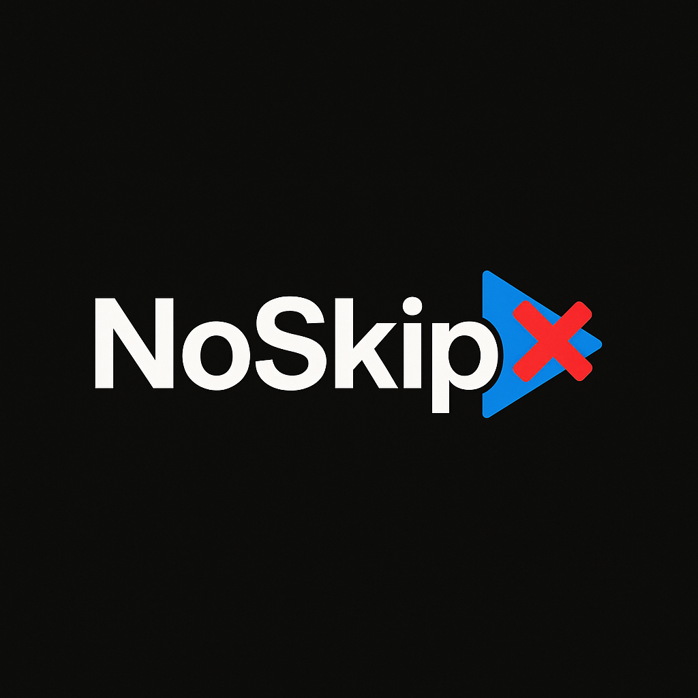

# Noskip - Smart Goal Tracking & AI Coaching



A cutting-edge goal tracking and AI coaching application built with React frontend and Express backend. Transform your ambitions into reality with AI-powered tracking, ASMR-inspired journaling, and smart analytics.

## 🚀 Features

### ✨ Core Features
- **Smart Goal Setting**: Create goals with deadlines and motivational reasons
- **AI-Powered Coaching**: OpenAI GPT-4o integration for personalized coaching
- **ASMR-Inspired Journaling**: Beautiful glassmorphic UI with hour-by-hour tracking
- **Smart Analytics**: AI-powered insights and pattern recognition
- **Streak Tracking**: Visual progress tracking with daily completion status

### 🤖 Smart Automation
- **Activity Categorization**: Auto-categorizes activities based on content patterns
- **Productivity & Energy Prediction**: AI predicts levels based on activity type and time
- **Smart Suggestions**: Context-aware activity suggestions based on patterns
- **Real-time Auto-completion**: Auto-suggests categories and scores as you type
- **Goal Integration**: Shows how daily activities connect to goal progress

### 🎨 Design Features
- **Glassmorphic UI**: ASMR-inspired design with smooth animations
- **Responsive Design**: Optimized for mobile, tablet, and desktop
- **Dark Theme**: Modern luxury black theme with subtle gold accents
- **Floating Particles**: Calming visual effects throughout the app

## 🛠️ Tech Stack

### Frontend
- **React 18** with TypeScript
- **Vite** for fast development and builds
- **shadcn/ui** components with Radix UI primitives
- **Tailwind CSS** for styling
- **TanStack Query** for server state management
- **Wouter** for lightweight routing

### Backend
- **Node.js** with Express.js
- **TypeScript** with ES modules
- **PostgreSQL** with Drizzle ORM
- **Neon Database** (serverless PostgreSQL)
- **OpenAI API** for AI coaching

## 🚀 Deployment

### Prerequisites
- Node.js 18+
- PostgreSQL database (Neon recommended)
- OpenAI API key

### Environment Variables
```env
DATABASE_URL=your_postgresql_connection_string
OPENAI_API_KEY=your_openai_api_key
NODE_ENV=production
```

### Deploy to Vercel
1. Clone this repository
2. Connect to Vercel
3. Set environment variables in Vercel dashboard
4. Deploy!

### Local Development
```bash
# Install dependencies
npm install

# Start development server
npm run dev

# Apply database schema
npm run db:push

# Build for production
npm run build
```

## 📱 Features in Detail

### Smart Analytics
- Weekly productivity patterns
- Peak performance hours analysis
- Category breakdowns
- Goal progress visualization

### Goal Integration
- Real-time goal-activity connection tracking
- Momentum analysis
- Smart recommendations for improvement
- Progress insights and predictions

### AI Coaching
- Personalized motivational messages
- Goal-specific advice
- Progress celebration and encouragement
- Failure prevention alerts

## 👨‍💻 Developer

**Built with ❤️ by Daniyal**

- GitHub: [Daniyal00982](https://github.com/Daniyal00982)
- LinkedIn: [ansaridaniyal](https://www.linkedin.com/in/ansaridaniyal)

## 📄 License

This project is built for personal and educational use.

---

Transform your goals into reality with Noskip's intelligent tracking and beautiful interface.